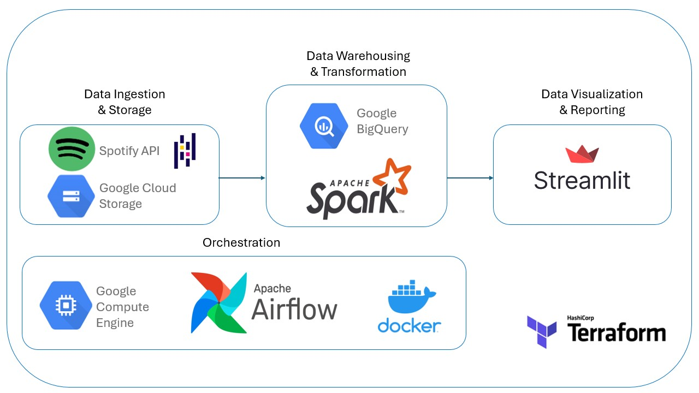

 <!-- Custom anchor -->
# Spotify Insights Data Pipeline Project
This project is a developed data pipeline that retrieves data from the Spotify Web API and presents insights on my listening history in a streamlit app.

## Table of Contents
[Purpose](#purpose)

  
<a href="#streamlit-app">Streamlit Application</a>

  
  - [Figure 1](#figure-1). Overview of the final application.

  
<a href="#data-stack">Data Stack</a>

  
  - [Figure 3](#figure-3). Diagram modelling the tools used in this project.

  
<a href="#data-sources">Data Sources</a>

  
  - [Figure 4](#figure-4). Example of visualization of wildfire perimeters data in the final report.
  - [Figure 5](#figure-5). Example of visualization of recreation trails data in the final report.

[Setup](#setup)

  
<a href="#workflow-orchestration">Workflow Orchestration</a>

  
  - [Figure 6](#figure-6). Sample of shapefile contents from data source.
  - [Figure 7](#figure-7). Comparison between geojson and newline-delimited geojson format, processed using the geojson2ndjson command-line tool.
  - [Figure 8](#figure-8). Airflow DAG graph for processing the recreation trails dataset.
  - [Figure 9](#figure-9). Airflow DAG graph for processing the wildfire perimeters dataset.
  - [Figure 10](#figure-10). Airflow DAG graph for running the DBT models (staging and core)

  
<a href="#data-warehouse-transformations">Data Warehouse Transformations</a>

  - [Figure 11](#figure-11). Spark job python script.

## Purpose
The purpose of this project was to design and develop a prototype of a modern data pipeline focused on wildfire activity and recreational trails in British Columbia (BC), Canada.

## Streamlit Application
Click [here](https://spotify-insights-project-cchow.streamlit.app/) to view.
\
\

Figure 1. Overview of the final report visualized as a streamlit application.
\
\
## Data Stack
- **Development Platform**: Docker
- **Infrastructure as Code (IAC)**: Terraform
- **Orchestration**: Apache Airflow
- **Data Lake**: Google Cloud Storage
- **Data Warehouse**: Google Big Query
- **Transformations**: Apache Spark
- **Data Visualization**: Streamlit Cloud

### Architecture

\

Figure 3. Diagram modelling the tools used in this project.
