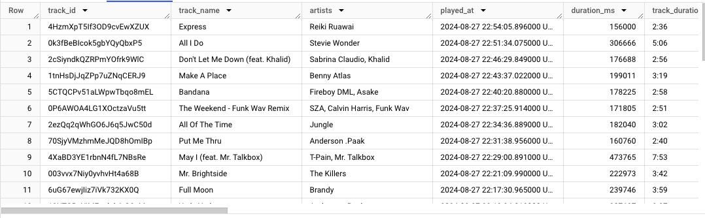
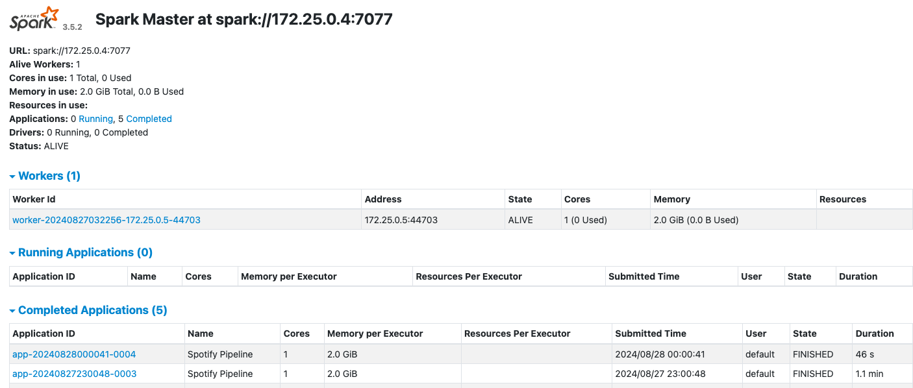

 <!-- Custom anchor -->
# Spotify Insights Data Pipeline Project
This project is a developed data pipeline that retrieves data from the Spotify Web API and presents insights on my listening history in a streamlit app.

## Table of Contents
[Objective](#objective)

  
<a href="#streamlit-application">Streamlit Application</a>

  
  - [Figure 1](#figure-1). Table listing the top ten most listened to songs in the final streamlit application.
  - [Figure 2](#figure-2). Analysis of the audio features of the top 10 songs listened to.

  
<a href="#data-stack">Data Stack</a>

  
  - [Figure 3](#figure-3). Diagram of the tools used in this project.

[Data Sources](#data-sources)

[Setup](#setup)

  
<a href="#workflow-orchestration">Workflow Orchestration</a>

  
  - [Figure 4](#figure-4). Airflow DAG modelling the tasks in this workflow.
  - [Figure 5](#figure-5). Sample view of the data in BigQuery.

  
<a href="#data-warehouse-transformations">Data Warehouse Transformations</a>

  - [Figure 6](#figure-6). Spark Master UI.

## Objective
The purpose of this project was to design and develop a modern data pipeline that interacts with the Spotify Web API and displays user listening history and audio analysis (specifically, using my personal spotify account).

## Streamlit Application
Access the reported results in the application here: [https://spotify-insights-project-cchow.streamlit.app/](https://spotify-insights-project-cchow.streamlit.app/)

Find the code for the streamlit application here: [https://github.com/casschow98/spotify-insights](https://github.com/casschow98/spotify-insights)

Figure 1. Table listing the top ten most listened to songs in the final streamlit application.

Figure 2. Analysis of the audio features of the top 10 songs listened to.

## Data Stack
- **Development Platform**: Docker
- **Infrastructure as Code (IAC)**: Terraform
- **Orchestration**: Apache Airflow
- **Data Lake**: Google Cloud Storage
- **Data Warehouse**: Google Big Query
- **Transformations**: Apache Spark
- **Data Visualization**: Streamlit Cloud

### Architecture

Figure 3. Diagram modelling the tools used in this project.

## Data Sources
- Access tokens for two types of API requests are renewed every time that the directed acyclic graph (DAG) is run
- **Client Credentials**
  - The purpose of using this type of request is to obtain audio feature data for each track using track_id's
  - This type of API request requires a user to obtain a Client Secret and Client ID obtained from the My App page of the user's dashboard. It is after converted to base-64 encoding
- **Authorization Code**
  - The purpose of using this type of request is to obtain the recently played tracks for a specific user profile
  - This type of API request also requires the Client Secret and Client ID converted to base-64 encoding as described above
  - It is also required to obtain an authorization code through accessing an authorization url using: client id, redirect uri, and scope (in this case, scope is user-read-recently-played)
  - Example:
     - "https://accounts.spotify.com/authorize?client_id={CLIENT_ID}&response_type=code&redirect_uri={REDIRECT_URI}&scope={SCOPE}"
  - With the base-64 encoded client id and client secret and the authorization code, user can obtain temporary access token and refresh token
  - Refresh token is used in this project to make requests to the API without the need to repeatedly access the url and obtain a new authorization code prior
 
  
- See [Spotify Documentation](https://developer.spotify.com/documentation/web-api/concepts/authorization) for information on submitting requests to the Spotify Web API.

## Setup
- **Google Cloud Platform**
  - Services account and project
  - IAM user permissions and API's
  - Credentials keyfile and ssh client
  - VM instance
- **VM Instance**
  - Anaconda, Docker, Terraform, Spark installation
  - GCP credentials retrieval
- **Docker**
  - Docker build context and volume mapping
- **Terraform**
  - Configure GCP provider with credentials
  - Resource configuration (i.e., storage bucket, dataset)

## Workflow Orchestration
- Apache Airflow orchestrates the workflow, managing the tasks of data ingestion, storage, and transformation
- Python and Spark operators execute tasks defined in a Directed Acyclic Graphs (DAG) and are triggered on an hourly schedule

Figure 4. Airflow DAG modelling the tasks in this workflow.

### Workflow Summary
1. get_recent_tracks_task
   - Retrieves access tokens and submits API requests to obtain the recently played tracks and audio features from the Spotify API
   - If the response returns empty (i.e., no new songs are found), the entire workflow stops and tasks are marked as skipped (pink) in Airflow
   - Uses Pandas library to manipulate dataframes, and saves data to a local .csv
2. upload_gcs_task
   - Uploads local .csv to Google Cloud Storage Bucket
   - Submits a BigQuery load job with a defined schema.json to copy data from the .csv in GCS to BigQuery
3. delete_local_task
   - Deletes the local directory containing the .csv
4. spark_submit_task
   - Creates a Spark session on a standalone cluster
   - Spark job reads from the BigQuery main table and creates a new table of the top ten tracks using pyspark functions
   - Writes summary table to the BigQuery dataset

Figure 5. Sample view of the data in BigQuery.

   
## Data Warehouse Transformations
- Apache Spark is used to apply basic transformations to the data in BigQuery and write a new summary table of the top ten tracks
- The Spark job operates on a standalone cluster and uses a spark-bigquery jar and a gcs-connector:hadoop3 jar to read and write to BigQuery

Figure 6. Spark Master UI.

